# gke-hello-app
gke-hello-app : Google Kubernetes Engine Cluster Demo # GKE # Gemini

## Objective
To create, test, and modify a Google Kubernetes Engine (GKE) cluster in Autopilot mode.

## GKE Cluster Demo

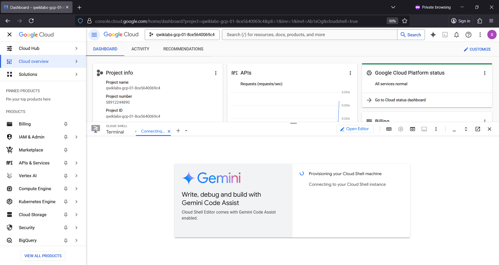

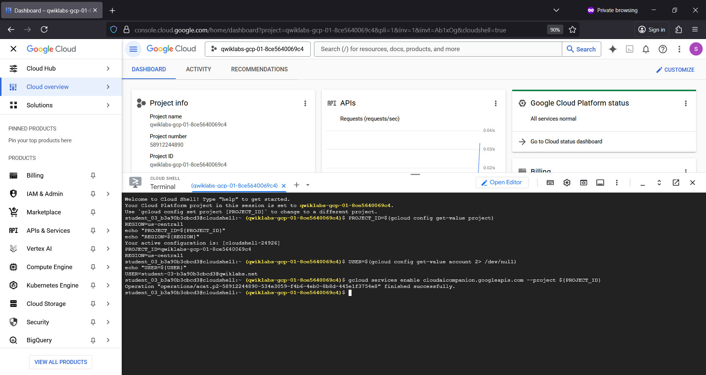

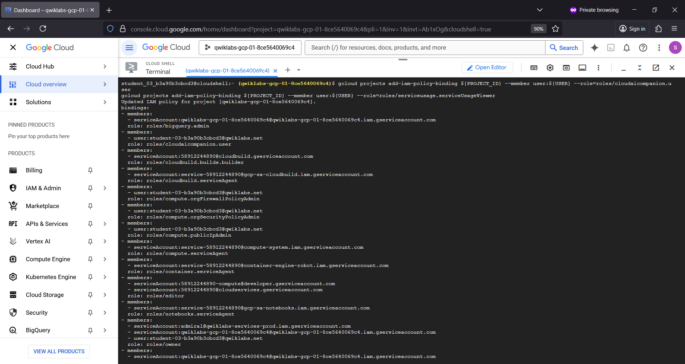

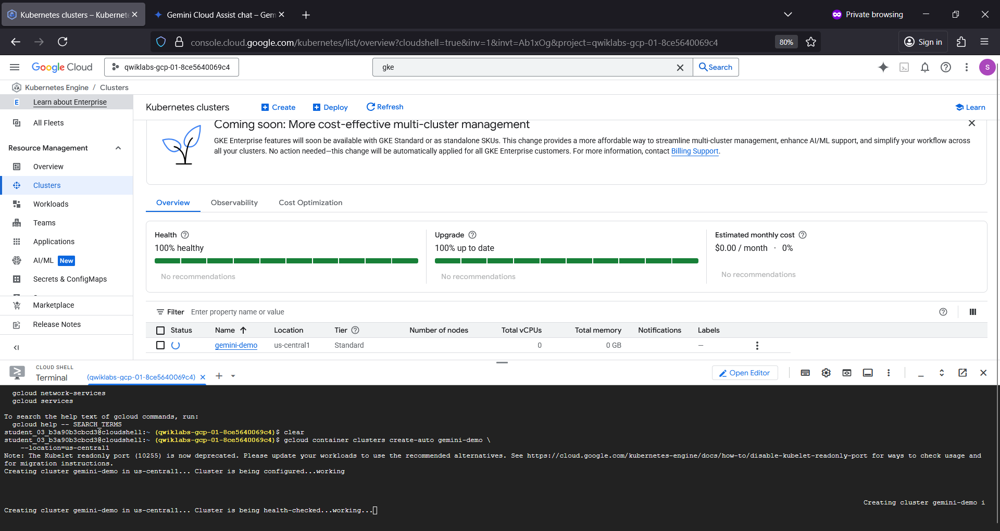

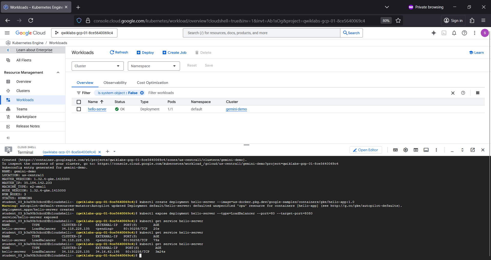

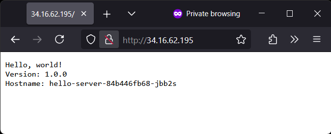

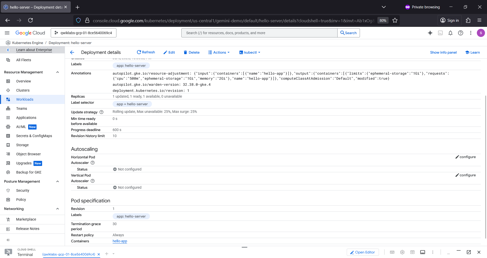

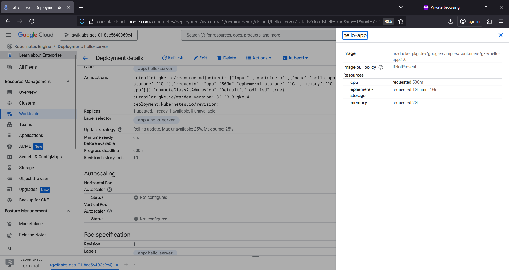

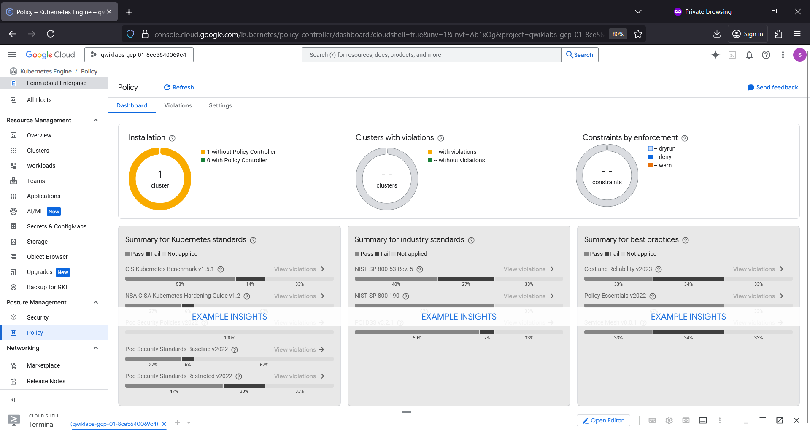

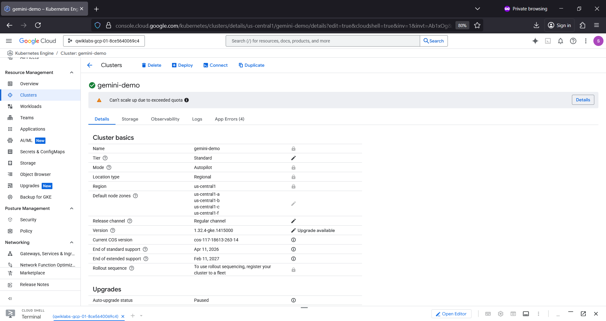

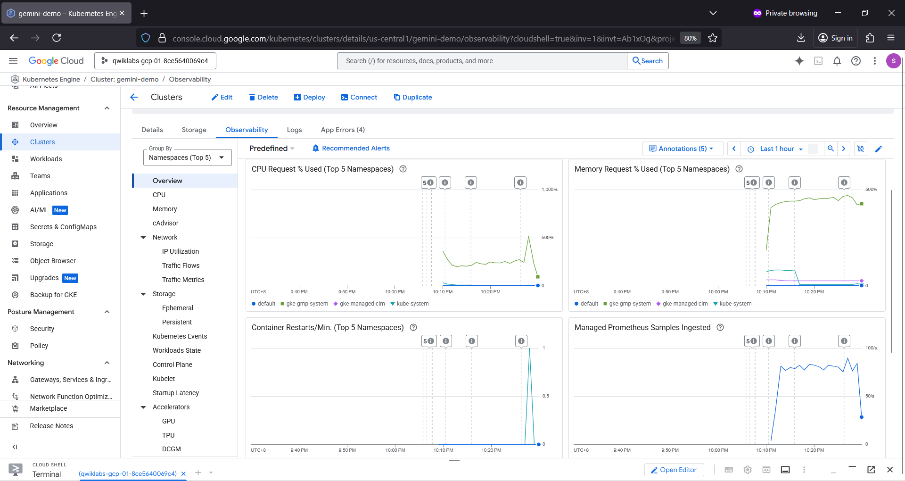
